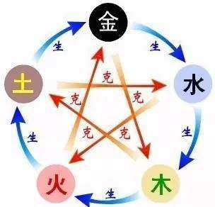

# 五行词典

|五行|木|火|土|金|水|
|----|----|----|----|----|----|
|季节|春|夏|长夏|秋|冬|
|五方|东|南|中|西|北|
|阶层|知识分子|资本家|政府官僚|领导人|百姓|
|国家|日欧|美国|中国|俄国|小国|
|目标|自由|财富|公正|安全|信仰|
|年龄|婴儿|孩子|青年|中年|老年|
|宗教|道教|沙漠教|儒教|马列|佛教|
|年份|1918-1929|1930-1941|1942-1953|1954-1965|1966-1977|
|年份|1978-1989|1990-2001|2002-2013|2014-2025|2026-2037|
|Big Five Personality|Openness|Extraversion|Conscientiousness|Neuroticism|Agreeableness|
|王一大五类|86|95|34|71|49|
|岗位|研发岗|赚钱岗|行政岗|监督管理岗|普通岗|

